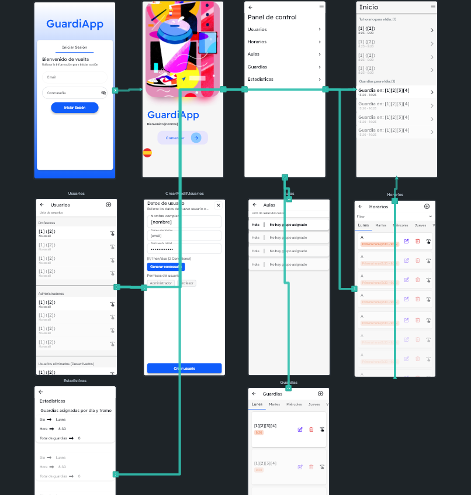
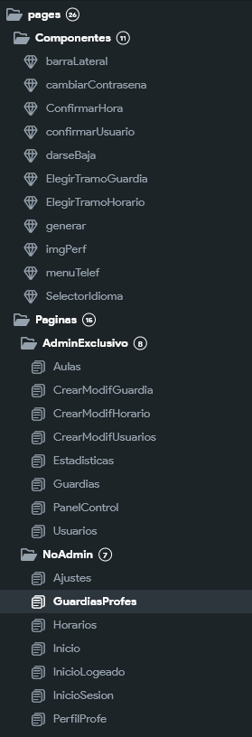
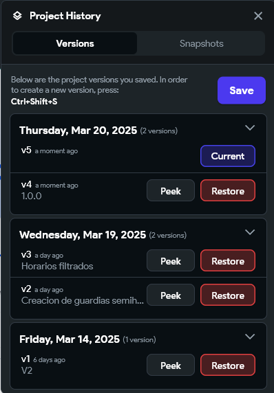
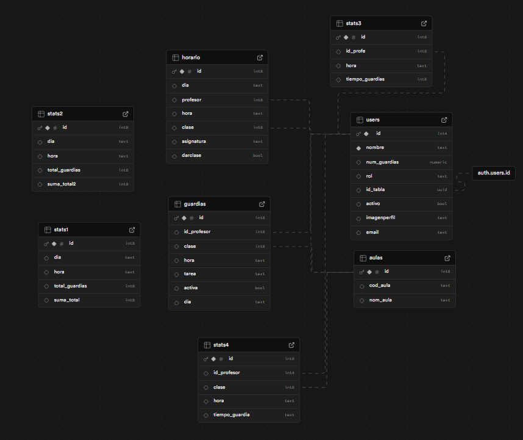

# GuardiApp

Este repositorio contiene el código fuente y la documentación del programa.

## Índice

1.  Descripción
2.  Características Principales
3.  Roles de Usuario
4.  Requisitos
5.  Instalación
6.  Uso
7.  Arquitectura (si aplica)
8.  Licencia
9. Contacto
10. Bibliografía
11. Tecnologías
12. Conclusiones y Futuras Mejoras
13. Manual de Usuario
14. Plan de negocio

## 1. Descripción

Este programa intenta simplificar y automatizar la gestión de horas de guardia en los centros educativos, permitiendo a directores, profesores y personal administrativo organizarse de manera efectiva, rápida y fácil.

## 2. Características principales

* **Gestión de Horarios:**
    * Creación y edición de horarios de profesores por el administrador.
    * Almacenamiento y gestión de horarios de profesores.
* **Gestión de Usuarios:**
    * Creación, edición y eliminación de usuarios.
    * Asignación automática de horarios a nuevos usuarios.
* **Gestión de Guardias:**
    * Creación, edición y eliminación de guardias.
    * Generación automática de guardias "Pendientes de asignar".
* **Estadísticas:**
    * Informes de guardias asignadas/no asignadas por día y hora.
    * Tiempo de guardia por profesor y grupo.
* **Profesor:**
    * Asignación de tareas a guardias propias.
    * Asignación de guardias "Pendientes" con restricciones.
* **Sala de Profesores:**
    * Vista de guardias del día actual y profesores disponibles.

## 3. Roles de Usuario

* **Administrador:** Gestiona horarios, usuarios y guardias.
* **Profesor:** Gestiona tareas en sus guardias y se asigna guardias disponibles.
* **Sala de Profesores:** Visualiza el estado de las guardias y profesores disponibles.

## 4. Requisitos

* Versión de Kotlin --> 1.8.22
* SDK mínimo --> 23
* SDK compilación --> 34
* Base de datos en la que almacenar horarios, usuarios, guardias, etc.

## 5. Instalación

1.  Descargar el [APK](https://github.com/BigBan0511/ProyectoDAMGuardias/releases/tag/Tag2) o la versión web [WEB](https://guardiapp2.flutterflow.app/)
2.  Iniciar sesión con las credenciales proporcionadas por el administrador.

## 6. Uso

### Rol Administrador

* **Gestión de Horarios:** Crea, edita o elimina horarios.
* **Gestión de Usuarios:** Crea, edita o elimina usuarios.
* **Gestión de Guardias:** Organiza las horas que cada profesor tiene de guardias y las requeridas para ello.
* **Estadísticas:** Guarda toda la información sobre las guardias y sus profesores.

### Rol Profesor

* **Gestión de Tareas:** Asigna tareas a sus guardias desde su panel.
* **Asignación de Guardias:** Selecciona guardias "Pendientes" disponibles y confirma la asignación.

### Rol Sala de Profesores

* **Visualización de Guardias:** Consulta el panel de guardias del día actual y la lista de profesores disponibles.

## 7. Arquitectura (Estructura y Diagrama)

## 8. Licencia

Este proyecto está bajo la licencia de código abierto.

## 9. Contacto

* Daniel Trillo Palacios, danitrillopa@gmail.com, BigBan0511  

* Sergio Oyola Márquez, sergioyola147@gmail.com, SOyola33

* Héctor Aparicio Sánchez, hectoraparicio2005@outlook.es, HectorAS2005

## 10. Bibliografía

* Flutterflow (Dart, Flutter...)
* Flutterflow Docs
* Supabase
* GitHub
* Google Suite
* Discord (Comunicación entre miembros del equipo)

## 11. Tecnologías

**Control de versiones**
 

## 11. **Tests**

### **Pruebas Unitarias para `generar_horario_vesper`**  

#### **Objetivo**  
Verificar que la función genera horarios aleatorios correctamente para profesores, asegurando que los datos insertados sean válidos y consistentes.  

#### **Escenarios de Prueba**  
- **Inserción de Datos:** Se deben insertar exactamente 25 registros por profesor (5 horas por 5 días).  
- **Múltiples Profesores:** La función debe generar horarios para distintos profesores sin mezclar datos.  
- **Rango de Clases Aleatorias:** Los valores asignados a la clase deben estar dentro del rango permitido (1 a 49).  
- **Asignaturas Válidas:** Todas las asignaturas generadas deben pertenecer a la lista predefinida.  
- **Distribución de Horas:** Cada día debe tener exactamente 5 horas asignadas en los rangos definidos.  
- **Reejecución de la Función:** La función debe evitar duplicados si se ejecuta varias veces.  

#### **Conclusión**  
Las pruebas confirman que la función genera horarios sin errores y con datos válidos, asegurando la coherencia de la información almacenada en la base de datos.  

---

### **Pruebas de Integración**  

#### **Objetivo**  
Garantizar que la aplicación interactúa correctamente con la base de datos y que los datos fluyen sin errores entre sus distintos módulos.  

#### **Escenarios Clave**  
- **Conexión a la base de datos:** La aplicación debe acceder sin fallos y manejar errores de conexión.  
- **Generación de horarios:** Los datos generados deben insertarse correctamente y reflejarse en la UI.  
- **Consulta y visualización:** Los horarios recuperados desde la base de datos deben ser precisos y actualizados.  
- **Modificación y eliminación:** Los cambios en los horarios deben guardarse correctamente sin inconsistencias.  
- **Control de accesos:** Solo los usuarios autorizados deben poder modificar horarios y datos sensibles.  
- **Rendimiento:** La aplicación debe mantenerse estable con múltiples usuarios accediendo simultáneamente.  

#### **Conclusión**  
Las pruebas aseguran que la aplicación mantiene la integridad de los datos, actualiza la información en tiempo real y gestiona correctamente los accesos de los usuarios.

## **Base de Datos**
[Documentación de la BD](https://github.com/BigBan0511/ProyectoDAMGuardias/blob/main/Documentaci%C3%B3n%20Base%20de%20datos.pdf)

## **Ficheros**
La app contiene ficheros de imágen como asset y buckets en Supabase donde guardar la imagen de perfil.

## **Despliege o Publicación**
Despliegue en Github

## **Acciones Explicadas de Flutterflow**
* [Documentación de la BD](https://github.com/BigBan0511/ProyectoDAMGuardias/blob/main/Documentaci%C3%B3n%20Acciones%20Flutterflow.pdf)

## 12. Manual de Usuario

* [Descargar el Manual de Usuario](https://github.com/BigBan0511/ProyectoDAMGuardias/blob/main/Manual%20de%20Usuario%20-%20GuardiApp.pdf)

## 13. Plan de Negocio

* [Plan de Negocio](https://github.com/BigBan0511/ProyectoDAMGuardias/blob/main/Plan%20de%20negocio.pdf)

## 14. Conclusiones y Futuras Mejoras 
**Conclusiones**
 
El desarrollo de GuardiApp ha permitido la creación de una herramienta eficiente para la gestión de guardias en el instituto, optimizando la comunicación entre profesores y mejorando la organización interna.
Entre los principales logros del proyecto, destacamos:

* Automatización de la asignación de guardias, reduciendo la carga administrativa.
* Mejora en la accesibilidad de la información, permitiendo a los profesores consultar horarios y guardias en tiempo real.
* Interfaz intuitiva, facilitando su uso sin necesidad de formación adicional.
* Flexibilidad y personalización, con opciones de configuración como cambio de idioma, modo oscuro y ajustes de perfil.

**Futuras mejoras**
* Notificaciones en tiempo real para avisar cambios en las guardias.
* Versión para iOS.
* Planos de las aulas del centro donde salgan las clases ocupadas.
* Integración con plataformas educativas como Google Classroom o Moodle.
* Mejora del rendimiento

